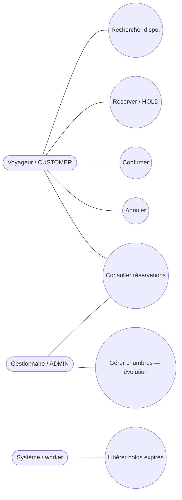
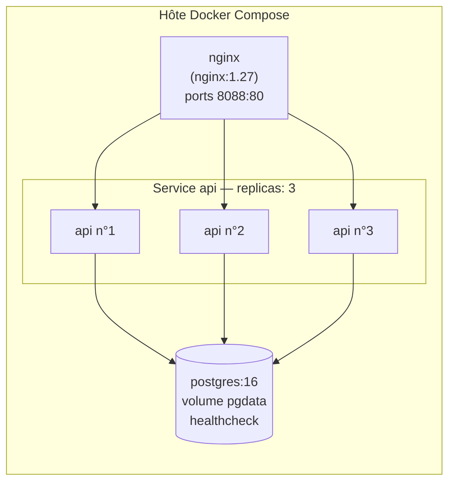
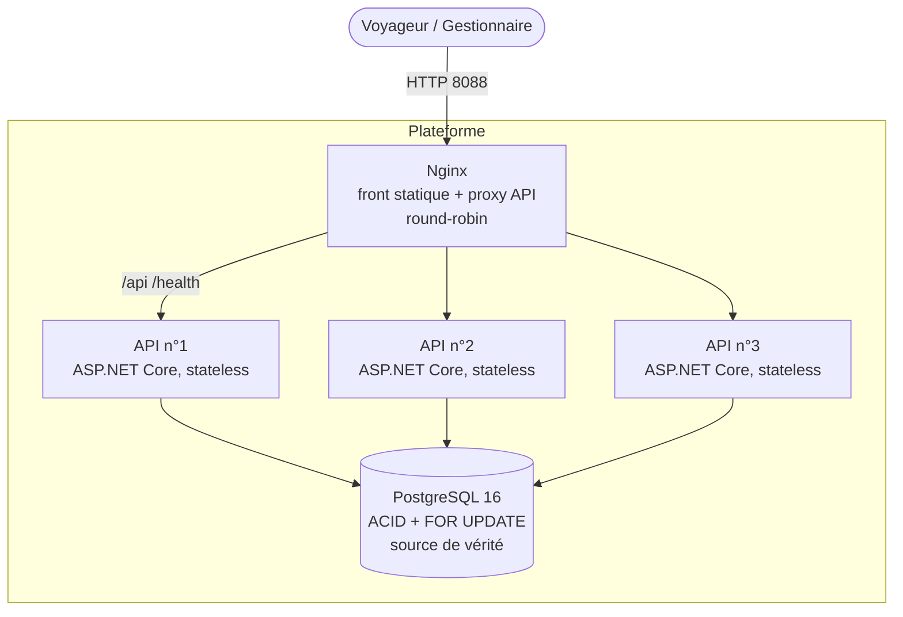
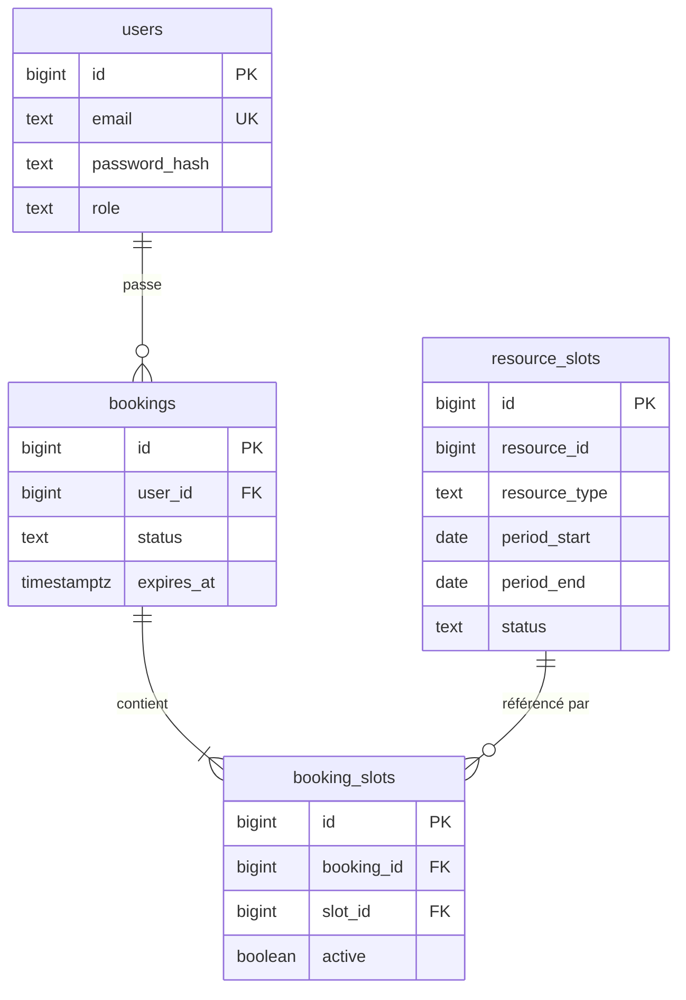
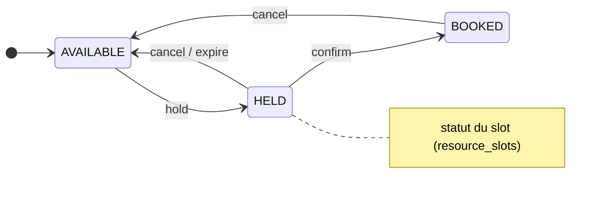
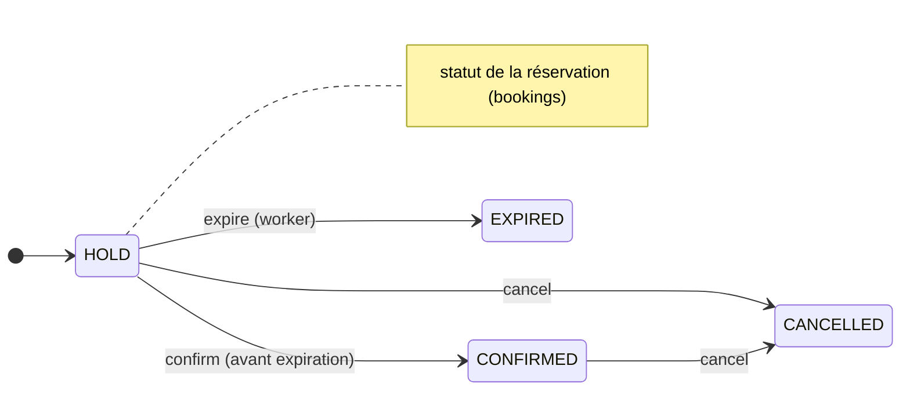

# Livrable 1 — Dossier d'architecture logicielle

**Projet :** Plateforme web de réservation d'hôtel
**Module :** Architecture Logicielle — Heuristiques et Compromis (5ESGI)
**Nature :** Livrable principal
**Version :** 2 (détaillée)

---

## Table des matières

1. Contexte, enjeux et périmètre
2. Parties prenantes et cas d'usage
3. Expression des besoins (fonctionnels et non fonctionnels)
4. Parcours utilisateur détaillés
5. Vue d'architecture (modèle 4+1)
6. Style architectural : choix et justification par heuristiques
7. Modèle de données (schéma détaillé + invariants)
8. Chemins critiques annotés (concurrence)
9. Sécurité
10. Compromis (trade-offs) — analyse ATAM / QOC
11. Traçabilité besoins → mécanismes → preuves
12. Attributs de qualité et tactiques
13. Risques architecturaux et dette technique
14. Évolutivité et trajectoire
15. Annexe A — ADR
16. Annexe B — Glossaire

---

## 1. Contexte, enjeux et périmètre

### 1.1 Contexte
Concevoir l'architecture logicielle d'une **plateforme web de réservation
d'hôtel** destinée au grand public (voyageurs) et aux gestionnaires
d'établissement. La plateforme doit intégrer, dès la conception, quatre axes
transverses : **accessibilité numérique**, **performance**, **expérience
utilisateur** et **adaptabilité aux besoins métier**.

### 1.2 Enjeu central (le « vrai » problème)
Le défi n'est pas la richesse fonctionnelle mais la **correction sous
concurrence** : dans un contexte distribué (plusieurs nœuds applicatifs) et sous
forte demande (ouverture des réservations pour un congrès, promotion
saisonnière), il faut garantir deux propriétés non négociables :

- **Atomicité** : une réservation portant sur plusieurs chambres est **tout ou
  rien** — jamais partiellement appliquée.
- **Absence de surréservation** : une même chambre pour une même nuit ne peut
  être attribuée qu'à **une seule** réservation active.

C'est un problème d'**intégrité transactionnelle en environnement concurrent et
distribué** ; il structure l'ensemble des choix d'architecture.

### 1.3 Périmètre
| Dans le périmètre | Hors périmètre (assumé) |
|---|---|
| Comptes, authentification, autorisation | Paiement en ligne (module externe) |
| Recherche de disponibilités | Moteur de tarification dynamique |
| Réservation (hold → confirmation), annulation | Notifications réelles email/SMS (stub) |
| Historique client | Dashboard gestionnaire complet |
| Expiration automatique des holds | Mode hors-ligne (offline) |
| Déploiement conteneurisé multi-nœuds | i18n multilingue |

Les éléments hors périmètre sont **identifiés, pas ignorés** : ils figurent dans
la trajectoire d'évolution (§ 14) — application de l'heuristique *« build for
today, design for change »*.

---

## 2. Parties prenantes et cas d'usage

### 2.1 Acteurs
- **Voyageur (CUSTOMER)** : recherche, réserve, confirme, annule, consulte son historique.
- **Gestionnaire (ADMIN)** : mêmes opérations avec un périmètre étendu (ownership
  contourné) ; dashboard identifié comme évolution.
- **Système (worker)** : acteur autonome libérant les holds expirés.

### 2.2 Diagramme de cas d'utilisation
```
        (Voyageur / CUSTOMER)                     (Gestionnaire / ADMIN)
             │                                          │
    ┌────────┼───────────┬───────────┐        ┌─────────┼──────────────┐
    ▼        ▼           ▼           ▼        ▼         ▼              ▼
Rechercher Réserver   Confirmer   Annuler  Se       Consulter     (Gérer chambres
dispo.     (HOLD)                          connecter réservations   — évolution)
                                                     (ownership étendu)

        (Système / worker)
             │
             ▼
      Libérer holds expirés  (déclenché périodiquement, sans acteur humain)
```

Vue équivalente (Mermaid) :



---

## 3. Expression des besoins

### 3.1 Besoins fonctionnels

| # | Besoin | Détail | Endpoint / composant | Statut |
|---|---|---|---|---|
| BF1 | Création de compte | email + mot de passe (≥ 8 car.), rôle CUSTOMER par défaut | `POST /api/auth/register` | ✅ |
| BF2 | Authentification | vérification BCrypt, émission JWT (60 min) | `POST /api/auth/login` | ✅ |
| BF3 | Recherche de disponibilités | par type de chambre + fenêtre de dates | `GET /api/availability` | ✅ |
| BF4 | Réservation multi-chambres | création atomique d'un **hold** (TTL 5 min) | `POST /api/bookings` | ✅ |
| BF5 | Confirmation | HOLD → CONFIRMED avant expiration | `POST /api/bookings/{id}/confirm` | ✅ |
| BF6 | Annulation / libération | libère les chambres, HOLD/CONFIRMED → CANCELLED | `DELETE /api/bookings/{id}` | ✅ |
| BF7 | Historique client | réservations de l'utilisateur courant | `GET /api/bookings` | ✅ |
| BF8 | Expiration automatique | libération des holds non confirmés | `HoldExpirationWorker` | ✅ |
| BF9 | Espace gestionnaire | rôle ADMIN + ownership étendu | rôle en place ; dashboard non | ⚠️ partiel |
| BF10 | Santé du nœud | supervision / répartiteur | `GET /health` | ✅ |

### 3.2 Besoins non fonctionnels (contraintes du sujet)

| # | Contrainte (énoncé) | Traduction technique | Réponse architecturale |
|---|---|---|---|
| BNF1 | Déploiement flexible : mutualisé **et** migrable cloud sans refonte | Portabilité, pas d'adhérence propriétaire | Conteneurs Docker, config 12-factor, aucune dépendance cloud spécifique |
| BNF2 | 500 utilisateurs simultanés en pic, réponse < 2 s | Scalabilité + latence maîtrisée | Nœuds stateless répliqués, index BD, pool de connexions, verrou fin (Livrable 2) |
| BNF3 | Authentification sécurisée **et** interface accessible clavier | Sécurité + accessibilité conjointes | JWT + BCrypt + ownership + rate limiting ; front HTML sémantique (Livrable 3) |
| BNF4 | Fonctionnel en connectivité faible | Résilience réseau côté client | Front statique léger, lecture idempotente ; **piste** Service Worker + cache |
| BNF5 | Agrégats statistiques sans exposer de PII | Séparation données publiques/privées | Slots (public) vs bookings (privé) ; agrégats `SELECT type, COUNT(*)` sans PII |
| BNF6 | Maintenable par 3 personnes, dépendances minimales | Simplicité, faible couplage | Monolithe modulaire en couches, stack standard, `docker compose up` |

---

## 4. Parcours utilisateur détaillés

### 4.1 Parcours nominal — réserver puis confirmer
```
Acteur : Voyageur                                     Codes attendus
──────────────────────────────────────────────────────────────────
1. POST /api/auth/register {email, password}          200  → { token }
   (ou /login si compte existant)                      contrainte BNF3 : mot de passe haché BCrypt
2. GET /api/availability?type=HOTEL_ROOM               200  → [ {slotId, resourceId, dates}, ... ]
      &from=YYYY-MM-DD&to=YYYY-MM-DD                    contrainte BNF2 : < 2 s ; lecture indexée
                                                        règle métier : dates dans le futur
3. POST /api/bookings {slotIds:[..]}                   201  → { bookingId, status:HOLD, expiresAt }
      (Authorization: Bearer <token>)                   cœur : atomicité + anti-surréservation
4. POST /api/bookings/{id}/confirm                     200  → { status:CONFIRMED }
                                                        règle : avant expiration du hold
5. GET /api/bookings                                   200  → historique de l'utilisateur
```

### 4.2 Parcours d'erreur — conflit de concurrence
```
Voyageur A et Voyageur B visent le MÊME slot au même instant :
  A: POST /api/bookings {slotIds:[42]}  → 201 (HOLD)
  B: POST /api/bookings {slotIds:[42]}  → 409 CONFLICT
     « Un des slots vient d'être réservé par un autre client. »
Aucune surréservation. Preuve : Livrable 2, § scénario B + tests.
```

### 4.3 Parcours d'erreur — cas limites
| Situation | Réponse | Mécanisme |
|---|---|---|
| Dates invalides / passées | 400 VALIDATION_ERROR | `BookingService.GetAvailabilityAsync` |
| Slot inexistant | 404 NOT_FOUND | vérification en transaction |
| Confirmation après expiration | 409 CONFLICT | contrôle `expires_at` |
| Réservation d'autrui | 403 FORBIDDEN | contrôle d'ownership |
| Sans token | 401 UNAUTHORIZED | `RequireAuthorization()` |
| Trop de requêtes | 429 RATE_LIMITED | `RateLimitMiddleware` |

### 4.4 Parcours système — expiration des holds
```
Toutes les N secondes (défaut 30) :
  HoldExpirationWorker → ReleaseExpiredHoldsAsync()
  UNE requête CTE atomique :
    - bookings HOLD dont expires_at < now()  → EXPIRED
    - booking_slots liés                     → active = FALSE
    - resource_slots correspondants          → AVAILABLE
  Idempotent et sûr même si plusieurs nœuds l'exécutent en parallèle.
```

---

## 5. Vue d'architecture (modèle 4+1)

Le modèle **4+1** de Kruchten organise l'architecture selon 4 vues + des scénarios.

### 5.1 Vue logique (composants et responsabilités)
Découpage en couches (Layered Architecture) au sein d'un nœud :

```
┌──────────────────────────────────────────────────────────────┐
│  Présentation   : ApiEndpoints (REST), Middlewares            │
│  ── ── ── ── ── ── ── ── ── ── ── ── ── ── ── ── ── ── ── ──   │
│  Métier         : BookingService, AuthService                 │
│  ── ── ── ── ── ── ── ── ── ── ── ── ── ── ── ── ── ── ── ──   │
│  Données        : BookingRepository, UserRepository, Migrator │
│  ── ── ── ── ── ── ── ── ── ── ── ── ── ── ── ── ── ── ── ──   │
│  Transverse     : ErrorHandling, RateLimit, HoldExpiration    │
└──────────────────────────────────────────────────────────────┘
```

| Composant | Responsabilité | Fichier |
|---|---|---|
| `Program.cs` | Composition (DI), pipeline, migrations au démarrage | `Program.cs` |
| `ApiEndpoints` | Endpoints REST (auth, disponibilité, réservations, santé) | `Endpoints/ApiEndpoints.cs` |
| `AuthService` | Inscription, login, émission JWT, hachage BCrypt | `Services/AuthService.cs` |
| `BookingService` | Règles métier (validation, orchestration) | `Services/BookingService.cs` |
| `BookingRepository` | Accès données + transactions `FOR UPDATE` | `Repositories/BookingRepository.cs` |
| `UserRepository` | Comptes utilisateurs (requêtes paramétrées) | `Repositories/UserRepository.cs` |
| `Migrator` | Migrations SQL versionnées, verrou consultatif | `Data/Migrator.cs` |
| `HoldExpirationWorker` | Libération périodique des holds expirés | `Workers/HoldExpirationWorker.cs` |
| `ErrorHandlingMiddleware` | Exceptions → HTTP normalisé + logs, pas de fuite interne | `Middleware/ErrorHandlingMiddleware.cs` |
| `RateLimitMiddleware` | Fenêtre glissante par utilisateur/IP → 429 | `Middleware/RateLimitMiddleware.cs` |

**Règle de dépendance :** Présentation → Métier → Données (jamais l'inverse).
Les couches communiquent par des types explicites (DTO / records), ce qui isole
le modèle interne du contrat externe (heuristique de communication du cours).

### 5.2 Vue des processus (exécution, concurrence)
- **N nœuds API** exécutent le même code, **sans état local** (aucune session en
  mémoire). L'état est intégralement en base.
- Chaque requête d'écriture ouvre **une transaction courte** ; la concurrence est
  sérialisée par PostgreSQL (`FOR UPDATE`).
- Le **worker d'expiration** tourne dans chaque nœud ; l'opération étant atomique
  et idempotente, l'exécution concurrente est sûre.
- **Migrations au démarrage** protégées par un **verrou consultatif**
  (`pg_advisory_lock`) : au boot simultané de plusieurs nœuds, un seul migre, les
  autres attendent puis constatent l'état à jour.

### 5.3 Vue de déploiement
```
Docker Compose
├── postgres   image postgres:16, volume persistant (pgdata), healthcheck
├── api ×3     build multi-stage, ASPNETCORE_ENVIRONMENT=Production,
│              secret JWT via variable d'environnement (Jwt__Secret)
└── nginx      ports 8088:80 ; sert le front statique + proxy /api et /health
               round-robin via resolver DNS Docker + proxy_next_upstream
```

Diagramme de déploiement (Mermaid) :



**Vue conteneurs (C4 — niveau 2) :**
```
                    ┌──────────────┐
   Clients  ─────►  │    Nginx     │  front statique + proxy API (round-robin)
                    └──────┬───────┘
              ┌────────────┼────────────┐
              ▼            ▼            ▼
        ┌─────────┐  ┌─────────┐  ┌─────────┐
        │ API n°1 │  │ API n°2 │  │ API n°3 │   ASP.NET Core 8, stateless
        └────┬────┘  └────┬────┘  └────┬────┘
             └───────────┼────────────┘
                         ▼
              ┌────────────────────┐
              │    PostgreSQL 16   │  ACID + SELECT ... FOR UPDATE
              └────────────────────┘
```

Diagramme équivalent (Mermaid) :



### 5.4 Vue de développement (organisation du code)
```
src/OnlineBooking.Api/
├── Endpoints/        (contrats REST)
├── Services/         (métier)
├── Repositories/     (persistance)
├── Data/             (migrator)
├── Workers/          (tâches de fond)
├── Middleware/       (transverse)
├── Configuration/    (options typées)
├── Common/           (exceptions applicatives)
└── Models/           (entités + DTO)
migrations/           (001_init.sql, 002_seed.sql)
tests/OnlineBooking.Tests/  (SmokeTests, ConcurrencyTests)
frontend/             (index.html, app.js, styles.css)
infra/                (nginx.conf, scripts de recette)
```

### 5.5 Scénarios (+1) — voir § 8 (chemins critiques annotés).

---

## 6. Style architectural : choix et justification

### 6.1 Style retenu : **monolithe modulaire distribué**
Un artefact applicatif unique, structuré en couches, **déployé en plusieurs
réplicas stateless** derrière un répartiteur, partageant une base transactionnelle
qui fait office de **source de vérité** et de **point de coordination de la
concurrence**.

### 6.2 Heuristiques appliquées (référencées au cours)
| Heuristique | Application concrète |
|---|---|
| **KISS** | Un projet, une base, un `docker compose up` ; pas d'orchestration inter-services |
| **DRY** | Cœur générique (moteur de slots) factorisé, réutilisable |
| **Cohésion forte / couplage faible** | Couches nettes, dépendances dirigées, DTO en frontière |
| **Repository Pattern** | Persistance abstraite derrière `*Repository` |
| **Layered Architecture** | Présentation / Métier / Données |
| **Build for today, design for change** | Modèle générique ressource×période ; évolutions identifiées, pas préimplémentées (anti sur-ingénierie / YAGNI) |
| **Rendre les erreurs visibles** | Middleware d'erreurs, logs explicites, codes HTTP normalisés |
| **Les décisions difficiles sont architecturales** | La stratégie de concurrence est traitée en priorité et documentée (ADR-001) |

### 6.3 Pourquoi pas microservices / event-driven ? (guide de sélection du cours)
| Question clé | Notre contexte | Verdict |
|---|---|---|
| Taille d'équipe | 3 (< 10) | Monolithe |
| Complexité du domaine | Simple, stable | Monolithe |
| Besoin de scalabilité | Réplicas stateless suffisent | Monolithe distribué |
| Expertise systèmes distribués | Limitée | Monolithe |
| Performance / latence | Critique, transactions ACID | Monolithe (pas de latence réseau interne) |

Un découpage en microservices imposerait la **cohérence via transactions
distribuées** (pattern Saga) pour préserver l'anti-surréservation : complexité
opérationnelle, cohérence éventuelle, debug distribué — **coûts injustifiés** pour
ce domaine. On applique l'**approche progressive** recommandée : commencer
monolithique, identifier les *bounded contexts*, n'extraire un service que si un
besoin réel apparaît (via *Strangler Fig* / *Branch by Abstraction*), en évitant
l'anti-pattern du *distributed monolith*.

### 6.4 En quoi le système est-il « distribué » ?
La dimension distribuée ne vient pas d'un découpage en services, mais de la
**multiplicité de nœuds applicatifs concurrents** convergeant vers un point de
coordination unique. Cela concentre la complexité distribuée là où elle est
**maîtrisée et éprouvée** (le moteur transactionnel de PostgreSQL) plutôt que de
la disperser dans du code applicatif.

---

## 7. Modèle de données (schéma détaillé)

Source de vérité : `migrations/001_init.sql`. Trois tables métier + une table de
suivi des migrations.

### 7.1 DDL commenté
```sql
-- Unité réservable atomique : une ressource (chambre) sur une période (nuit).
CREATE TABLE resource_slots (
    id            BIGSERIAL PRIMARY KEY,
    resource_id   BIGINT NOT NULL,               -- identifiant de la chambre
    resource_type TEXT   NOT NULL,               -- 'HOTEL_ROOM' (générique)
    period_start  DATE   NOT NULL,
    period_end    DATE   NOT NULL,
    status        TEXT   NOT NULL DEFAULT 'AVAILABLE',  -- AVAILABLE | HELD | BOOKED
    CONSTRAINT uq_slot_resource_period UNIQUE (resource_id, period_start, period_end),
    CONSTRAINT ck_slot_period CHECK (period_end > period_start),
    CONSTRAINT ck_slot_status CHECK (status IN ('AVAILABLE','HELD','BOOKED'))
);
CREATE INDEX ix_slots_search
    ON resource_slots (resource_type, status, period_start, period_end);

-- Engagement d'un utilisateur sur une ou plusieurs unités.
CREATE TABLE bookings (
    id         BIGSERIAL PRIMARY KEY,
    user_id    BIGINT NOT NULL REFERENCES users (id),
    status     TEXT   NOT NULL,                   -- HOLD | CONFIRMED | CANCELLED | EXPIRED
    expires_at TIMESTAMPTZ,                       -- échéance du hold
    created_at TIMESTAMPTZ NOT NULL DEFAULT now(),
    CONSTRAINT ck_booking_status CHECK (status IN ('HOLD','CONFIRMED','CANCELLED','EXPIRED'))
);
CREATE INDEX ix_bookings_expiry ON bookings (status, expires_at);

-- Association réservation <-> slots.
CREATE TABLE booking_slots (
    id         BIGSERIAL PRIMARY KEY,
    booking_id BIGINT NOT NULL REFERENCES bookings (id) ON DELETE CASCADE,
    slot_id    BIGINT NOT NULL REFERENCES resource_slots (id),
    active     BOOLEAN NOT NULL DEFAULT TRUE
);

-- INVARIANT ANTI-SURRÉSERVATION (garde-fou ultime) :
-- un slot ne peut être lié qu'à AU PLUS UNE réservation active.
CREATE UNIQUE INDEX uq_active_slot
    ON booking_slots (slot_id) WHERE active = TRUE;
```

**Modèle entité-association (Mermaid) :**



### 7.2 Machines à états
```
resource_slots.status :   AVAILABLE ──hold──► HELD ──confirm──► BOOKED
                              ▲                 │
                              └──── cancel / expire ──┘   (retour AVAILABLE)

bookings.status :   HOLD ──confirm──► CONFIRMED
                     │  │
                     │  └── expire (worker) ──► EXPIRED
                     └──── cancel ────────────► CANCELLED
                     CONFIRMED ── cancel ─────► CANCELLED
```

Équivalents Mermaid :





### 7.3 Invariants garantis par le schéma
- **I1** — Unicité d'une unité de ressource sur une période : `uq_slot_resource_period`.
- **I2** — Cohérence de période : `ck_slot_period` (`end > start`).
- **I3** — Statuts contraints : `ck_slot_status`, `ck_booking_status`.
- **I4 (central)** — **Un slot ↔ au plus une réservation active** : index unique
  partiel `uq_active_slot`. C'est l'invariant anti-surréservation, imposé par la
  base indépendamment du code applicatif.

### 7.4 Séparation données publiques / privées (BNF5)
- **Public / agrégeable** : `resource_slots` (inventaire, statuts) → statistiques
  d'occupation sans PII (`SELECT resource_type, status, COUNT(*) ...`).
- **Privé** : `users`, `bookings` (rattachement à une personne). Les agrégats
  métier n'ont pas besoin de joindre les données personnelles.

---

## 8. Chemins critiques annotés (concurrence)

### 8.1 Création de réservation (hold) — `ReserveAsync`
```sql
BEGIN;                                                        -- transaction courte
  -- (1) VERROU : sérialise les demandes concurrentes sur ces slots
  SELECT id, status FROM resource_slots
   WHERE id = ANY($ids) FOR UPDATE;
  -- (2) VALIDATION : tous doivent exister et être AVAILABLE
  --     sinon  -> NotFound (404)  ou  Conflict (409) + ROLLBACK
  -- (3) CRÉATION du booking en HOLD (expires_at = now() + TTL)
  INSERT INTO bookings (user_id, status, expires_at) VALUES ($u,'HOLD',$e) RETURNING id;
  -- (4) MARQUAGE des slots
  UPDATE resource_slots SET status='HELD' WHERE id = ANY($ids);
  -- (5) LIEN booking <-> slots (active=TRUE) : l'index unique partiel s'applique
  INSERT INTO booking_slots (booking_id, slot_id, active)
    SELECT $b, s, TRUE FROM unnest($ids) AS s;
COMMIT;
-- Gestion d'erreur : violation 23505 (index unique) -> Conflict (409) ; sinon ROLLBACK + relance.
```
**Pourquoi c'est correct :** l'étape (1) fait attendre toute transaction
concurrente visant un même slot jusqu'au COMMIT/ROLLBACK de la première. La
seconde relit alors un statut `HELD`/`BOOKED` et échoue en (2). L'étape (5) +
`uq_active_slot` constituent une **seconde barrière** : même en cas de course
résiduelle, une double insertion active est physiquement rejetée (23505 → 409).

**Diagramme de séquence — course concurrente (Mermaid) :**

```mermaid
sequenceDiagram
    participant A as Voyageur A
    participant B as Voyageur B
    participant API as Nœud API
    participant DB as PostgreSQL
    A->>API: POST /api/bookings {slot 42}
    B->>API: POST /api/bookings {slot 42}
    API->>DB: BEGIN; SELECT ... FOR UPDATE (slot 42)  [A]
    API->>DB: BEGIN; SELECT ... FOR UPDATE (slot 42)  [B attend le verrou]
    DB-->>API: verrou accordé à A (B bloqué)
    API->>DB: slot AVAILABLE -> HOLD, INSERT booking + booking_slots  [A]
    API->>DB: COMMIT [A]
    API-->>A: 201 Created (HOLD)
    DB-->>API: verrou libéré -> B relit : slot = HELD
    API->>DB: ROLLBACK [B] (slot indisponible)
    API-->>B: 409 Conflict
```

### 8.2 Confirmation — `ConfirmAsync`
```sql
BEGIN;
  SELECT user_id, status, expires_at FROM bookings WHERE id=$id FOR UPDATE;  -- verrou ligne booking
  -- EnsureOwner : sinon Forbidden (403)
  -- si status != HOLD          -> Conflict (409)
  -- si expires_at <= now()     -> Conflict (409, hold expiré)
  UPDATE bookings SET status='CONFIRMED', expires_at=NULL WHERE id=$id;
  UPDATE resource_slots SET status='BOOKED'
    WHERE id IN (SELECT slot_id FROM booking_slots WHERE booking_id=$id AND active);
COMMIT;
```

### 8.3 Annulation — `CancelAsync`
```sql
BEGIN;
  SELECT user_id, status FROM bookings WHERE id=$id FOR UPDATE;   -- verrou
  -- EnsureOwner (403) ; si déjà CANCELLED/EXPIRED -> Conflict (409)
  UPDATE resource_slots SET status='AVAILABLE'
    WHERE id IN (SELECT slot_id FROM booking_slots WHERE booking_id=$id AND active);
  UPDATE booking_slots SET active=FALSE WHERE booking_id=$id;     -- libère l'index unique
  UPDATE bookings SET status='CANCELLED' WHERE id=$id;
COMMIT;
```

### 8.4 Expiration des holds — `ReleaseExpiredHoldsAsync` (une seule requête CTE)
```sql
WITH expired AS (
  UPDATE bookings SET status='EXPIRED'
   WHERE status='HOLD' AND expires_at < now() RETURNING id),
freed_slots AS (
  UPDATE booking_slots SET active=FALSE
   WHERE booking_id IN (SELECT id FROM expired) AND active RETURNING slot_id),
released AS (
  UPDATE resource_slots SET status='AVAILABLE'
   WHERE id IN (SELECT slot_id FROM freed_slots) RETURNING id)
SELECT (SELECT count(*) FROM expired);
```
**Atomique et idempotent** → exécution multi-nœuds sûre (pas de double libération).

---

## 9. Sécurité

| Menace | Contre-mesure | Emplacement |
|---|---|---|
| Vol de mot de passe | Hachage **BCrypt**, jamais de stockage en clair | `AuthService` |
| Usurpation de session | **JWT** signé HMAC-SHA256, durée 60 min, issuer/audience validés | `AuthService`, `Program.cs` |
| Énumération de comptes | Message de login **neutre** (« email ou mot de passe invalide ») | `AuthService.LoginAsync` |
| IDOR (accès aux réservations d'autrui) | Contrôle d'**ownership** (`EnsureOwner`), ADMIN excepté | `BookingRepository` |
| Injection SQL | Requêtes **100 % paramétrées** | tous les repositories |
| Abus / déni de service | **Rate limiting** fenêtre glissante par utilisateur/IP → 429 | `RateLimitMiddleware` |
| Fuite d'information technique | Middleware mappe les exceptions, masque les détails internes | `ErrorHandlingMiddleware` |
| Secret en clair dans le code | Secret JWT **hors code**, **validé au démarrage** (refus si vide) | `Program.cs`, user-secrets / env |

**Compromis sécurité ⇄ UX (C4) :** BCrypt est volontairement lent (coût CPU au
login), le rate limiting peut générer de rares faux positifs, la MFA ajouterait
de la friction — arbitrage : sécurité prioritaire, friction maîtrisée.

**En production :** TLS terminé au répartiteur, secret long et aléatoire via
coffre, éventuelle MFA, rate limiting partagé (Redis).

---

## 10. Compromis (trade-offs) — analyse ATAM / QOC

Méthode : identifier les exigences non fonctionnelles, détecter les **tensions**,
cartographier les options, associer avantages/inconvénients, décider et
documenter (cf. cours). Cartographie complète : `rendu/tensions-non-fonctionnelles.md`.

### 10.1 Points sensibles et points de compromis (vocabulaire ATAM)
- **Point sensible :** la stratégie de verrouillage sur `resource_slots` — elle
  détermine à la fois la correction (anti-surréservation) et la performance
  d'écriture.
- **Point de compromis :** PostgreSQL comme coordinateur unique — améliore
  cohérence et simplicité, au détriment de la scalabilité en écriture.
- **Risque :** points chauds sur une chambre très demandée (contention localisée).

### 10.2 Compromis détaillés

**C1 — Cohérence forte ⇄ Performance / débit**
- *Tension :* sérialiser les accès à un même slot (`FOR UPDATE`) réduit le débit.
- *Options (QOC) :* (a) verrou pessimiste par ligne ; (b) verrou optimiste + retry ;
  (c) verrou de table.
- *Décision :* (a), verrou **au grain ligne**.
- *Justification :* correction garantie, contention limitée aux seules chambres
  visées. *Prix accepté :* latence accrue sur points chauds. *Mitigations :*
  transactions courtes, index adaptés, lecture non bloquante.

**C2 — Cohérence ⇄ Disponibilité (CAP)**
- *Tension :* face à un partitionnement, on ne peut être à la fois C et A.
- *Décision :* système **CP** — en cas de doute, refuser proprement (409/erreur)
  plutôt que risquer une double réservation.
- *Prix :* écritures indisponibles si la BD est injoignable. *Mitigation :*
  réplication primaire/secondaire + bascule en production.
- *PACELC :* en fonctionnement normal (Else), on privilégie la **cohérence** sur
  la latence (EC).

**C3 — Atomicité ⇄ Scalabilité horizontale**
- *Tension :* les nœuds scalent, mais convergent vers une base = goulot.
- *Décision :* scalabilité applicative illimitée, **contention BD assumée**.
- *Prix :* scalabilité écriture non linéaire. *Mitigations :* pool de connexions,
  partitionnement par établissement/région, réplicas de lecture à l'échelle.

**C4 — Sécurité ⇄ Expérience / Performance** (voir § 9).

**C5 — Verrou pessimiste ⇄ optimiste**
- *Décision :* **pessimiste**, car les conflits sur une même chambre sont
  fréquents en pic ; l'échec immédiat (409) évite une logique de retry côté client.

**C6 — Blocage par hold ⇄ Disponibilité de l'inventaire**
- *Tension :* le hold « gèle » l'inventaire le temps de confirmer.
- *Décision :* hold à **TTL court configurable** (défaut 300 s), libéré
  automatiquement par le worker (défaut toutes les 30 s).

**C7 — Simplicité ⇄ Rate limiting exact**
- *Décision :* comptage **local par nœud** (simple, sans dépendance) ; seuil
  global approximatif derrière le round-robin. *Cible :* Redis partagé (ADR-005).

**C8 — Durabilité ⇄ Performance d'écriture**
- *Décision :* durabilité prioritaire (une réservation confirmée est un
  engagement) ; commit durable sur volume persistant.

### 10.3 Synthèse des arbitrages
| Axe privilégié | Axe partiellement sacrifié | Justification métier |
|---|---|---|
| Cohérence | Performance brute, disponibilité en écriture | Une surréservation est inacceptable |
| Sécurité | Fluidité maximale | Données personnelles (+ paiement à venir) |
| Durabilité | Latence d'écriture | Réservation confirmée = engagement |
| Simplicité | Scalabilité extrême, rate limiting exact | Équipe de 3, évolutions identifiées |

**Principe directeur :** *en cas de doute, refuser proprement plutôt que risquer
une incohérence.* La correction métier prime sur la performance et la
disponibilité absolue.

---

## 11. Traçabilité besoins → mécanismes → preuves

| Propriété / besoin | Mécanisme | Preuve |
|---|---|---|
| Atomicité (tout-ou-rien) | Transaction unique par opération | recette + `ConcurrencyTests` |
| Anti-surréservation (I4) | `FOR UPDATE` + index unique partiel | `ConcurrencyTests`, `infra/concurrency-test.sh`, course HTTP (Livrable 2) |
| Sérialisation des accès | `SELECT … FOR UPDATE` | `ConcurrencyTests` |
| Libération des holds (BF8) | worker + requête CTE atomique | recette (expiration) |
| Cohérence inter-nœuds | source de vérité unique | `fault-tolerance-test` |
| Durabilité (BNF-implicite) | persistance PostgreSQL (volume) | redémarrage stack |
| Autorisation / anti-IDOR | `EnsureOwner` | `security-test` |
| Performance lecture (BNF2) | index `ix_slots_search`, lecture non bloquante | mesures Livrable 2 (p99 ≈ 26 ms) |
| Migrations sûres multi-nœuds | verrou consultatif `pg_advisory_lock` | démarrage simultané des réplicas |

---

## 12. Attributs de qualité et tactiques

| Attribut | Tactique employée |
|---|---|
| **Performance** | Index dédiés, transactions courtes, pool de connexions, lecture non bloquante, réplicas applicatifs |
| **Disponibilité** | Nœuds stateless interchangeables, `proxy_next_upstream`, healthcheck, worker idempotent |
| **Sécurité** | Défense en profondeur (auth, ownership, rate limiting, SQL paramétré) |
| **Maintenabilité** | Couches, faible couplage, DTO en frontière, tests automatisés, une commande de déploiement |
| **Testabilité** | Repositories isolables, tests de concurrence sur base réelle |
| **Portabilité** | Conteneurs, config par environnement, aucune adhérence cloud |
| **Accessibilité** | Front HTML sémantique, contrôles natifs (Livrable 3) |
| **Observabilité** | Logs explicites, endpoint `/health` renvoyant le nœud |

---

## 13. Risques architecturaux et dette technique

| # | Risque | Impact | Probabilité | Mitigation |
|---|---|---|---|---|
| R1 | Contention écriture sur une chambre très demandée | Latence localisée | Moyenne | Transactions courtes ; à l'échelle : partitionnement |
| R2 | BD = point de défaillance unique | Indisponibilité écriture | Faible/Moyenne | Réplication + bascule en prod |
| R3 | Rate limiting local non exact | Seuil global dépassable | Certaine (assumée) | Redis partagé (ADR-005) |
| R4 | Absence de mode offline (BNF4) | UX dégradée en zone à faible réseau | Moyenne | Service Worker + cache (trajectoire) |
| R5 | Secret JWT mal géré | Compromission | Faible | Hors code, validé au démarrage, coffre en prod |
| R6 | Accessibilité partielle (clavier/focus) | Exclusion d'utilisateurs | Moyenne | Corrections priorisées (Livrable 3) |
| R7 | Dashboard gestionnaire absent | Fonction métier manquante | Certaine (périmètre) | Évolution planifiée |

---

## 14. Évolutivité et trajectoire

**Court terme (qualité de la démo / conformité) :** corrections d'accessibilité
bloquantes (clavier, focus visible), régions live pour les messages.

**Moyen terme (performance / robustesse) :** cache Redis en lecture, réplicas de
lecture PostgreSQL, CDN + compression pour le front, rate limiting partagé (Redis).

**Long terme (échelle / métier) :** partitionnement par établissement/région,
auto-scaling des nœuds, extraction éventuelle de services (Strangler Fig) si un
*bounded context* le justifie, i18n (fr/en/ar avec sens de lecture), MFA,
notifications réelles (SendGrid / Twilio), mode offline (Service Worker),
dashboard gestionnaire.

**Principe de trajectoire :** favoriser la **réversibilité** des décisions et le
**changement local** ; n'introduire de complexité (cache, services, sharding)
qu'en réponse à un besoin **mesuré** (« pas de silver bullet », « mesurer avant
d'optimiser »).

---

## 15. Annexe A — Architecture Decision Records

Détail complet dans `adr/ADR.md`. Synthèse :

| ADR | Décision | Compromis lié |
|---|---|---|
| ADR-001 | PostgreSQL + `FOR UPDATE` comme coordinateur de concurrence | C1, C3 |
| ADR-002 | Monolithe modulaire distribué plutôt que microservices | C3 |
| ADR-003 | Nœuds stateless + JWT | C4 |
| ADR-004 | Verrou pessimiste plutôt qu'optimiste | C1, C5 |
| ADR-005 | Rate limiting local (Redis en cible) | C7 |
| ADR-006 | Front statique léger (pas de SPA lourd) | accessibilité, BNF4 |

---

## 16. Annexe B — Glossaire

- **Slot (`resource_slot`)** : unité réservable atomique = une chambre pour une nuit.
- **Hold** : réservation temporaire (statut HOLD) à durée de vie limitée (TTL).
- **Ownership** : rattachement d'une réservation à son propriétaire ; base du
  contrôle d'accès (anti-IDOR).
- **Index unique partiel** : contrainte d'unicité s'appliquant à un sous-ensemble
  de lignes (`WHERE active = TRUE`) ; garde-fou anti-surréservation.
- **Verrou pessimiste (`FOR UPDATE`)** : verrouillage des lignes lues jusqu'à la
  fin de la transaction ; sérialise les accès concurrents.
- **CAP / PACELC** : cadres de raisonnement sur les compromis cohérence /
  disponibilité / latence en systèmes distribués.
- **ADR** : Architecture Decision Record — journal des décisions et de leurs raisons.
- **ATAM / QOC** : méthodes d'analyse des compromis architecturaux.
