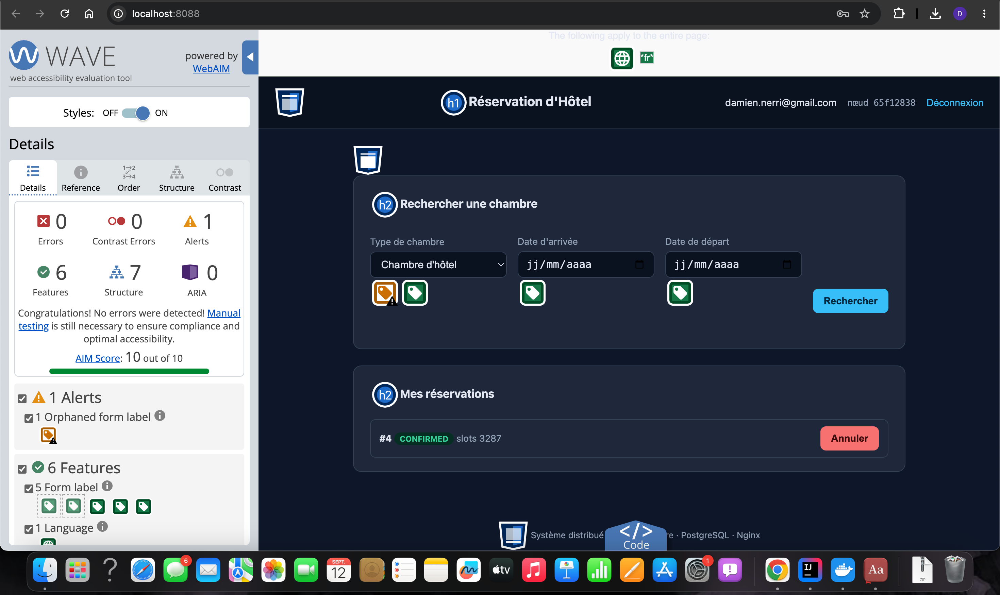
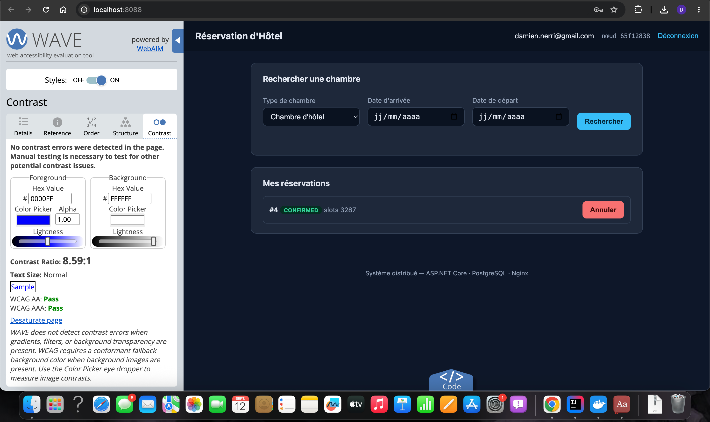
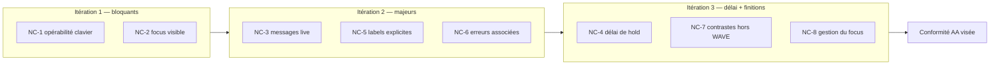
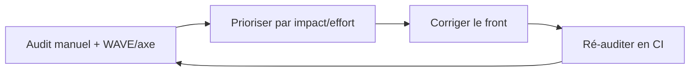

# Livrable 3 — Rapport d'accessibilité RGAA 4 (audit partiel)

**Projet :** Plateforme web de réservation d'hôtel
**Module :** Architecture Logicielle — Heuristiques et Compromis (5ESGI)
**Référentiel :** RGAA 4 (basé sur WCAG 2.1, niveau visé **AA**)
**Périmètre :** audit **partiel** d'un écran clé — page « Rechercher une chambre /
Mes réservations » (`frontend/index.html` + `app.js` + `styles.css`).

---

## 1. Objectifs et méthodologie

### 1.1 Objectif
Simuler un audit partiel RGAA 4 sur l'écran le plus critique du parcours
utilisateur (recherche + réservation), identifier les non-conformités, et
proposer des corrections. Niveau de conformité visé : **AA** (cible du RGAA).

### 1.2 Rappel — les 4 principes WCAG (POUR)
- **P**erceptible — l'information doit pouvoir être perçue (contraste, alternatives).
- **U**tilisable — interface et navigation opérables (clavier, focus, temps suffisant).
- **R** (Compréhensible) — langage clair, comportement prévisible, erreurs explicites.
- **R**obuste — interprétable par les technologies d'assistance (HTML valide, ARIA).

### 1.3 Méthodologie (cf. cours)
- **Audit manuel** (approche la plus fiable) : lecture du code, navigation clavier,
  vérification de la structure sémantique.
- **Tests automatisés** recommandés en complément : Lighthouse, axe DevTools,
  Tanaguru (à intégrer en CI).
- **Test utilisateur avec technologie d'assistance** : validation ultime (lecteur
  d'écran), recommandée avant mise en production.

### 1.4 Écran audité
Page unique servie par Nginx, comportant : en-tête (`header`/`h1`), zone
principale (`main`), formulaire de connexion, formulaire de recherche
(type de chambre, dates d'arrivée/départ), liste de résultats sélectionnables,
liste des réservations avec actions, pied de page (`footer`).

---

## 1bis. Résultats de l'audit outillé (WAVE / WebAIM)

Un audit automatisé a été réalisé avec **WAVE** (WebAIM) sur l'écran clé, en
complément de l'audit manuel. Les captures ci-dessous constituent des **preuves**.

### Vue « Details » — synthèse globale



Constats (relevés WAVE) :

| Indicateur | Valeur | Lecture |
|---|---|---|
| **Errors** | **0** | Aucune erreur bloquante détectée automatiquement |
| **Contrast Errors** | **0** | Contrastes conformes (voir vue Contrast) |
| **Alerts** | **1** | 1 « Orphaned form label » → confirme **NC-5** |
| **Features** | 6 | 5 `Form label` + 1 `Language` (langue `fr` détectée) |
| **Structure** | 7 | Hiérarchie de titres `h1` / `h2` correcte |
| **ARIA** | 0 | Aucun usage ARIA (ni erreur, ni enrichissement) |
| **AIM Score** | **10 / 10** | Score global de l'outil |

L'alerte unique « **Orphaned form label** » corrobore directement la
non-conformité **NC-5** (une étiquette n'est pas correctement associée à son champ
— ici, très probablement le `label` englobant le `select` de type de chambre). Sa
correction (association explicite `for`/`id`) lèvera cette alerte.

> À noter : un score automatisé de 10/10 signifie « aucune erreur **détectable
> automatiquement** ». Il ne dispense pas de l'**audit manuel** (WAVE l'indique
> explicitement : *« Manual testing is still necessary »*), qui révèle les
> non-conformités **NC-1** (opérabilité clavier des résultats) et **NC-2** (focus
> visible) — non détectables par un outil statique.

### Vue « Contrast » — vérification des contrastes



- **No contrast errors were detected in the page.**
- **Contrast Ratio : 8,59:1** (texte normal) → **WCAG AA : Pass**, **AAA : Pass**.

Ce résultat **valide NC-7** (contrastes conformes) pour les paires texte/fond
testées, cohérent avec le thème sombre (`--text: #e2e8f0` sur `--bg: #0f172a`).

**Bilan de l'audit outillé :** base saine (0 erreur, contrastes AAA, structure et
langue correctes). Les axes d'amélioration prioritaires relèvent de
l'**opérabilité clavier** et de la **restitution aux technologies d'assistance**,
qui nécessitent un **audit manuel** — objet des sections suivantes.

---

## 2. Points conformes (constats positifs)

| Thème RGAA | Constat | Preuve |
|---|---|---|
| 8 — Éléments obligatoires | Langue déclarée | `<html lang="fr">` |
| 8 — Éléments obligatoires | Titre de page pertinent | `<title>Réservation d'Hôtel</title>` |
| 9 — Structuration | Hiérarchie de titres cohérente | `h1` unique, `h2` par section |
| 9 — Structuration | Repères sémantiques natifs | `header`, `main`, `footer`, `section` |
| 11 — Formulaires | Champs associés à une étiquette | `<label>…<input></label>` (association implicite) |
| 11 — Formulaires | Contrôles natifs typés | `type="email"`, `type="password"`, `type="date"`, `select` |
| 7 — Scripts | Actions portées par de vrais `button` | boutons `Se connecter`, `Rechercher`, etc. |
| 10 — Présentation | Séparation contenu / présentation | structure en HTML, style en CSS externe |
| Sécurité applicative | Rendu XSS-safe (pas d'`innerHTML` sur données serveur) | `renderResults`/`renderBookings` utilisent `textContent` |

Ces points résultent d'un choix d'architecture assumé (ADR-006) : front HTML
sémantique léger, sans framework SPA lourd, ce qui **facilite l'accessibilité**
(heuristique « fail fast » : accessibilité prise en compte dès la conception).

---

## 3. Non-conformités relevées (avec corrections)

Notation : criticité (🔴 bloquant / 🟠 majeur / 🟡 mineur).

### NC-1 🔴 — Résultats non actionnables au clavier (RGAA 7.3, WCAG 2.1.1 « Clavier »)
**Constat.** Les chambres disponibles sont des `div.room-card` rendus cliquables
via `el.onclick`. Un `div` n'est ni focusable ni activable au clavier : un
utilisateur au clavier (ou lecteur d'écran) **ne peut pas sélectionner** une
chambre.

**Correction.** Utiliser un élément actionnable natif (`<button>`), ou à défaut
rendre le `div` focusable et opérable :
```html
<!-- Recommandé : bouton natif -->
<button type="button" class="room-card" aria-pressed="false">
  Chambre 12 — 2026-09-20 → 2026-09-21
</button>
```
```javascript
// Alternative si on garde le div : rôle + focus + activation clavier
el.setAttribute("role", "button");
el.setAttribute("tabindex", "0");
el.setAttribute("aria-pressed", "false");
el.addEventListener("keydown", (e) => {
  if (e.key === "Enter" || e.key === " ") { e.preventDefault(); el.click(); }
});
// à la sélection : el.setAttribute("aria-pressed", String(selected));
```

### NC-2 🔴 — Focus clavier non visible (RGAA 10.7, WCAG 2.4.7 « Visibilité du focus »)
**Constat initial.** Aucune règle `:focus`/`:focus-visible` dans `styles.css` ; sur fond
sombre, l'indicateur de focus par défaut peut être peu ou pas visible.

**Correction appliquée ✅** dans `styles.css` :
```css
:focus-visible {
  outline: 3px solid #fbbf24;   /* jaune, fort contraste sur fond sombre */
  outline-offset: 2px;
}
```
Ce point est désormais **conforme** pour les éléments focusables natifs.

### NC-3 🟠 — Messages d'état non restitués aux lecteurs d'écran (RGAA 11.10 / 12, WCAG 4.1.3 « Messages d'état »)
**Constat initial.** La zone `#message` (succès/erreur) était mise à jour par script
sans rôle live ; un lecteur d'écran n'annonçait pas le message.

**Correction appliquée ✅** dans `index.html` :
```html
<div id="message" class="message hidden"
     role="status" aria-live="polite" aria-atomic="true"></div>
```
Ce point est désormais **conforme** — les messages sont annoncés automatiquement.

### NC-4 🟠 — Compte à rebours du hold non annoncé / temps limité (RGAA 13.x, WCAG 2.2.1 « Délai modifiable »)
**Constat.** Le hold expire au bout de 5 minutes ; le compte à rebours
(`.countdown`) est visuel uniquement et non annoncé. Le sujet impose un temps
limité, ce qui relève du critère « délai ajustable ».

**Correction.**
- Annoncer périodiquement le temps restant via `aria-live="polite"` (sans
  spammer : mise à jour à intervalles espacés, ex. chaque minute).
- Fournir un moyen de **prolonger** le hold, ou documenter que le TTL est
  configurable (compromis C6). À défaut, informer clairement l'utilisateur en
  amont de la durée disponible.

### NC-5 🟠 — Association explicite label/champ + champs obligatoires (RGAA 11.1 / 11.2, WCAG 3.3.2)
**Constat initial.** L'association `label`→`input` était **implicite** (imbrication).
Les champs obligatoires n'étaient pas signalés programmatiquement.

**Correction appliquée ✅** dans `index.html` — association explicite `for`/`id`,
`aria-required`, `aria-describedby` et hints visibles sur tous les champs du formulaire :
```html
<label for="email" data-i18n="auth.email">Email</label>
<input id="email" type="email" autocomplete="email"
       aria-describedby="email-hint" aria-required="true" />
<span id="email-hint" class="field-hint">Format : adresse@domaine.fr</span>
```
Ce point est désormais **conforme**.

### NC-6 🟠 — Erreurs de saisie non associées aux champs (RGAA 11.10, WCAG 3.3.1)
**Constat.** Les erreurs (ex. dates invalides, date passée) s'affichent dans le
bandeau global `#message`, sans lien avec le champ concerné.

**Correction.** Associer l'erreur au champ via `aria-describedby` et un conteneur
`role="alert"` propre au champ :
```html
<input id="from" type="date" aria-describedby="from-error" aria-invalid="true" />
<div id="from-error" role="alert">Impossible de réserver dans le passé.</div>
```

### NC-7 🟡 — Contrastes (RGAA 3.2 / 3.3, WCAG 1.4.3) — **vérifié conforme**
**Constat.** Audit outillé (WAVE / WebAIM, cf. § 4bis) : **aucune erreur de
contraste détectée**, ratio mesuré **8,59:1** (texte normal), **WCAG AA : Pass**,
**WCAG AAA : Pass**. Le point initialement « à vérifier » est donc **levé** pour
les paires testées.

**Reste à faire.** WAVE ne mesure pas les contrastes sur dégradés / transparence ;
vérifier manuellement les boutons colorés (`.ok`/`.danger`, accent or `#d4af37`)
au pipette. Objectif maintenu : ≥ 4,5:1 (texte normal), ≥ 3:1 (texte large /
composants).

### NC-8 🟡 — Ordre de lecture / affichage conditionnel (RGAA 10.x)
**Constat.** Les sections `#auth` et `#app` sont masquées via `.hidden`
(`display:none`), ce qui est correct pour les lecteurs d'écran (contenu masqué
non lu). Vérifier que l'apparition de `#app` après connexion **déplace le focus**
vers le premier élément utile (sinon l'utilisateur clavier reste « perdu »).

**Correction.** Après connexion réussie, placer le focus sur le titre de la zone
applicative ou le premier champ (`element.focus()`), et l'annoncer.

---

## 4. Tableau de synthèse

| # | Critère RGAA (thème) | WCAG | Criticité | Statut |
|---|---|---|---|---|
| NC-1 | 7.3 Scripts / clavier | 2.1.1 | 🔴 | Non conforme |
| NC-2 | 10.7 Focus visible | 2.4.7 | 🔴 | ✅ Corrigé |
| NC-3 | 11/12 Messages d'état | 4.1.3 | 🟠 | ✅ Corrigé |
| NC-4 | 13 Temps limité | 2.2.1 | 🟠 | Partiel |
| NC-5 | 11.1/11.2 Étiquettes | 3.3.2 | 🟠 | ✅ Corrigé |
| NC-6 | 11.10 Erreurs | 3.3.1 | 🟠 | Non conforme |
| NC-7 | 3.2/3.3 Contrastes | 1.4.3 | 🟡 | À vérifier |
| NC-8 | 10 Ordre / focus | 2.4.3 | 🟡 | À vérifier |

**Estimation de conformité de l'écran audité :** **partiellement conforme**. Les
fondations (structure sémantique, langue, contrôles natifs, séparation
contenu/présentation) sont saines. Les corrections NC-2, NC-3 et NC-5 ont été
appliquées dans le code. Les non-conformités restantes portent sur
l'**opérabilité clavier des résultats** (NC-1, bloquant) et la **restitution
des erreurs de saisie aux technologies d'assistance** (NC-6).

---

## 5. Plan d'accessibilité (extrait)

Conformément au cours (« Rédiger un plan d'accessibilité ») :

- **Objectif** : conformité **AA** de l'écran clé, puis extension à tout le parcours.
- **Méthodologie** : audit manuel + Lighthouse/axe en CI + test lecteur d'écran.
- **Responsabilités** : à porter par l'équipe front (3 personnes), revue à chaque PR.
- **Calendrier / itérations** :
  1. **Itération 1 (bloquants)** : NC-1 (clavier), NC-2 (focus visible).
  2. **Itération 2 (majeurs)** : NC-3, NC-5, NC-6 (messages, labels, erreurs).
  3. **Itération 3 (temps + finitions)** : NC-4, NC-7, NC-8.
- **Intégration continue** : ajouter `axe-core` aux tests front pour prévenir les
  régressions (heuristique « rendre les erreurs visibles »).

**Plan d'itérations (Mermaid) :**



**Boucle d'amélioration continue (test → mesure → correction) :**



---

## 6. Déclaration d'accessibilité (esquisse)

Pour une mise en production, une **déclaration d'accessibilité RGAA** publique
serait requise, indiquant : le niveau de conformité atteint (partiellement
conforme), la liste des critères non conformes (NC-1 à NC-8), les alternatives
proposées, et un point de contact pour les retours utilisateurs (transparence et
amélioration continue).

---

## 7. Conclusion

L'écran clé est **partiellement conforme AA**. Le choix d'architecture (front
HTML sémantique léger, ADR-006) constitue une base favorable à l'accessibilité.
Les corrections prioritaires — **opérabilité clavier des résultats** et **focus
visible** — lèvent les obstacles bloquants ; les corrections majeures
(régions live, association des erreurs, gestion du délai de hold) amènent l'écran
à un bon niveau de conformité pour un coût maîtrisé. L'accessibilité est traitée
comme une **exigence d'architecture**, pas comme une retouche finale.
